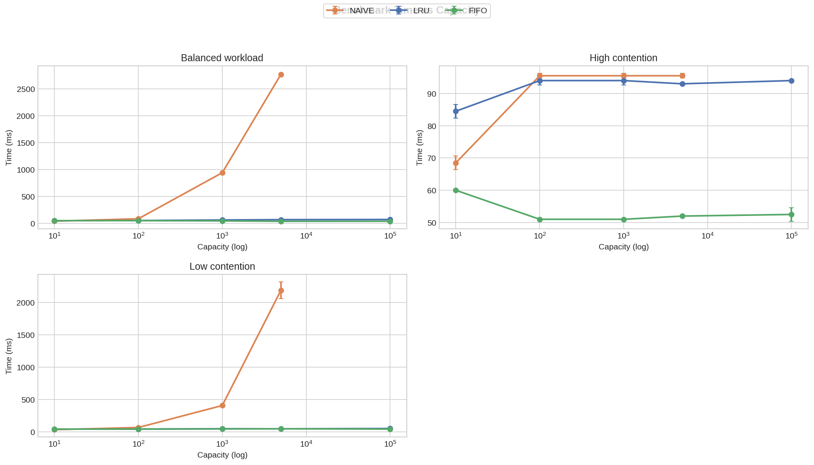
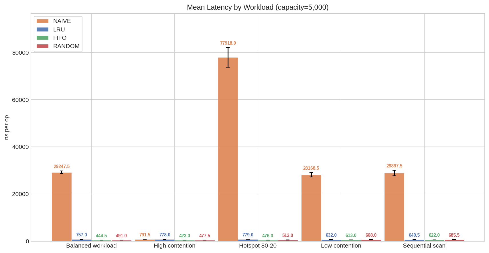
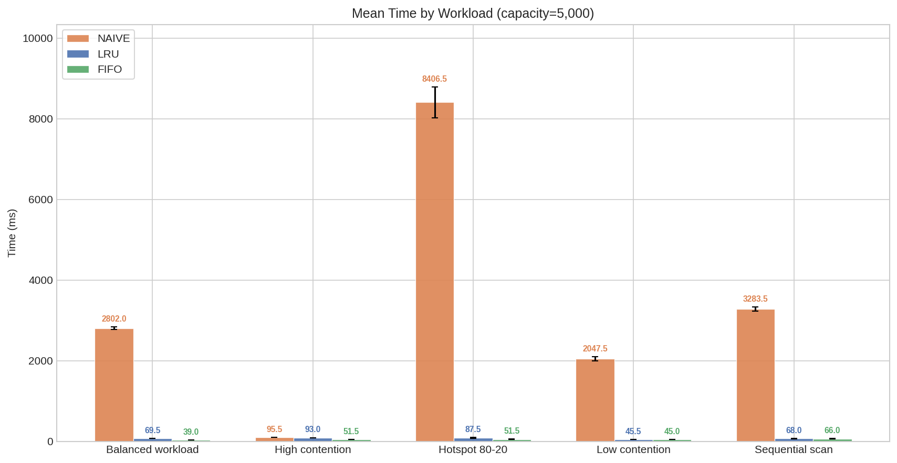

# Buffer Pool Replacement Strategies — C++ Implementation

A **Buffer Pool** implemented in C++ benchmarking three replacement strategies:
**Naive LRU O(n)**, **Optimized LRU O(1)**, and **FIFO O(1)** — modelled after
real database buffer pool managers.

Read the full blog post: [BLOG](https://medium.com/@minhnguyenn/fifo-vs-lru-a-benchmark-study-of-buffer-pool-replacement-strategies-32d3bc1f606b)

---

## Replacement Strategies

| Strategy  | Data Structure               | Eviction Complexity |
| --------- | ---------------------------- | ------------------- |
| Naive LRU | Vector + Linear Scan         | O(n)                |
| LRU O(1)  | Doubly Linked List + HashMap | O(1)                |
| FIFO O(1) | Doubly Linked List + HashMap | O(1)                |

---

## Benchmark Results

### Time vs Capacity — All Workloads



### Mean Latency by Workload



### Mean Time by Workload



More benchmark results in [benchmark/](./benchmark/)

---

## Key Findings

- **FIFO is the fastest** across all five workloads and all tested capacities.
  It performs zero per-access bookkeeping, giving it a consistent speed advantage
  over LRU regardless of workload type.
- **LRU beats FIFO only once** — at capacity=10 under the Hotspot 80-20 workload,
  where its recency tracking retains hot pages more effectively in a very small buffer.
- **Naive LRU collapses at scale** — at capacity=5,000 it reaches 2,700ms in the
  Balanced workload while LRU and FIFO remain under 75ms.
- **Naive LRU beats optimized LRU at capacity=10** under High Contention — a
  small flat scan over 10 items outperforms hash map and pointer overhead at that scale.

---

## Workloads

| Workload        | Operations | Key Range | Description                         |
| --------------- | ---------- | --------- | ----------------------------------- |
| High Contention | 120,000    | 20        | Few keys, maximum eviction pressure |
| Balanced        | 90,000     | 2,000     | Moderate reuse, typical DB pattern  |
| Low Contention  | 70,000     | 100,000   | Near-zero reuse, isolates overhead  |
| Hotspot 80-20   | 100,000    | 5,000     | 80% accesses on 20% of keys         |
| Sequential Scan | 100,000    | 100,000   | Sequential access, no locality      |

Each workload runs across five capacities: **10, 100, 1,000, 5,000, 100,000 frames**.
Each configuration is repeated **2 runs** with a fixed seed for reproducibility.

---

## How to Run

### Requirements

```bash
cmake
g++ (C++20 or higher)
python3 + pip
```

#### Set up

```bash
python3 -m venv .venv
source .venv/bin/activate
pip install -r requirements.txt
```

#### Plot result

```bash
python3 benchmark/plot.py
```

- Or pass a custom path

```bash
python3 benchmark/plot.py path/to/benchmark_results.csv
```

#### Bash script

```bash
bash scripts/benchmark.sh
```
